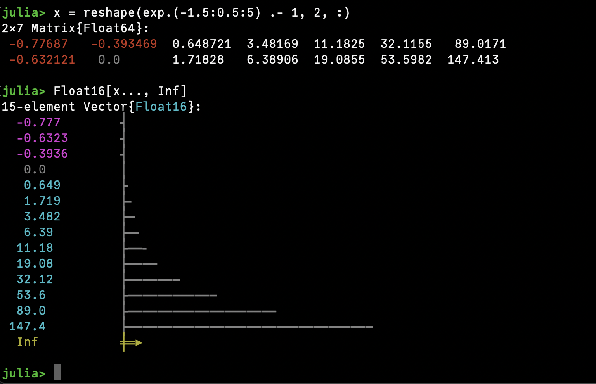

# InTheRed.jl

This package overloads `Base.show` to change how numbers are printed:
* Negative numbers are red
* Zero is light gray
* `Inf`, `NaN` and `missing` are yellow
* Low-precision numbers (like `Float32`, `Int16`) are cyan, or magenta if negative.

In addition, vectors of real numbers are displayed with a bar graph alongside their values.
Vectors of complex numbers show their absolute value as a bar graph, and phase as a compass direction.

## Examples

## Elsewhere

* [OhMyREPL.jl](https://github.com/KristofferC/OhMyREPL.jl) changes the text you type at the prompt, instead of what is printed.

* [UnicodePlots.jl](https://github.com/JuliaPlots/UnicodePlots.jl) allows much more complicated plotting as text.
